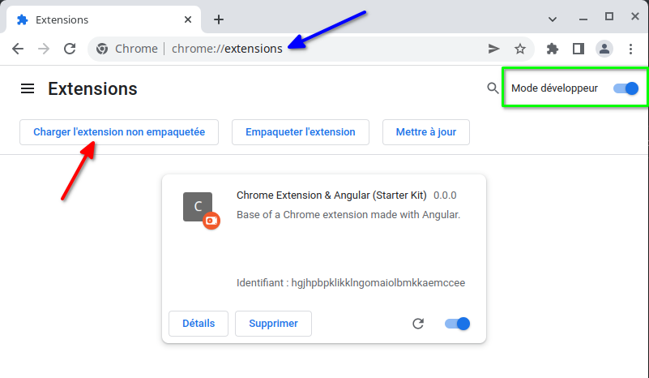
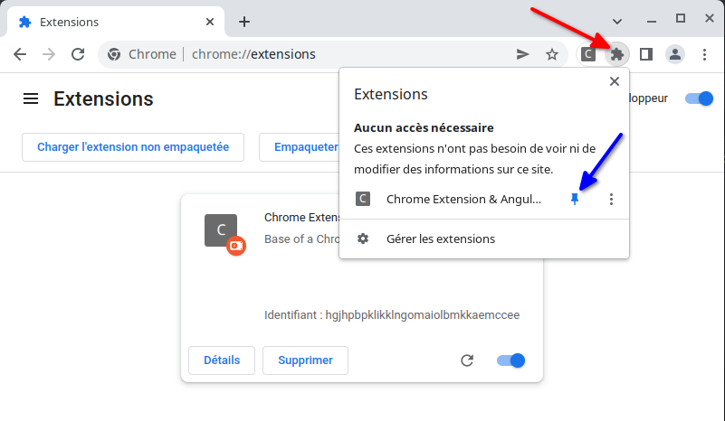
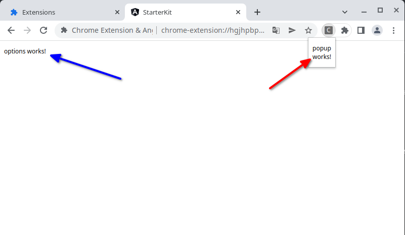
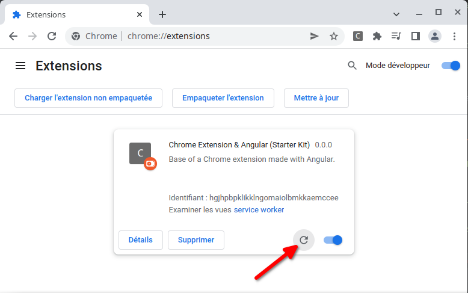
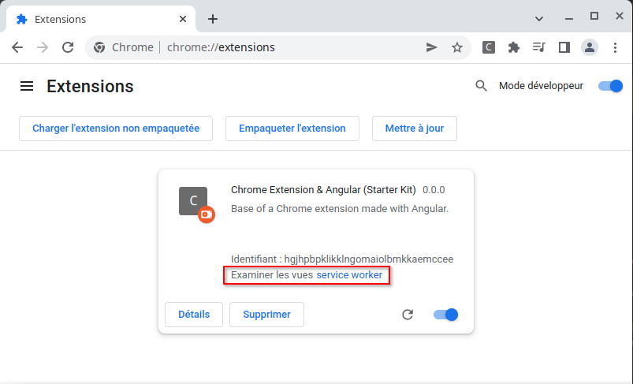
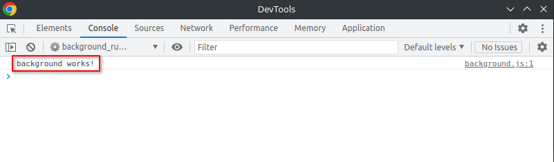
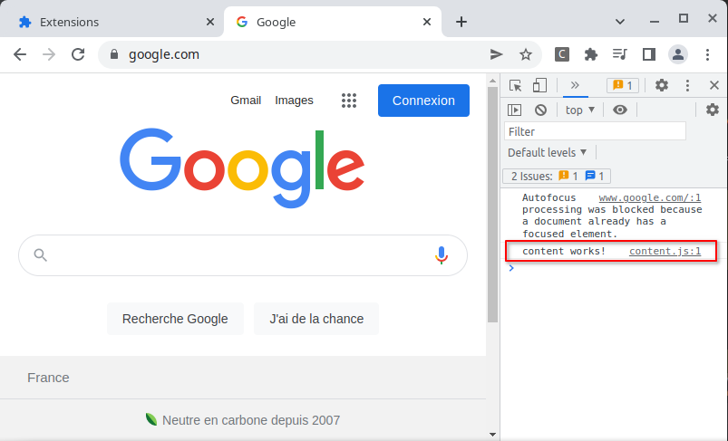

:toc: macro
:toc-title: Summary
:toclevels: 3
:numbered:

ifndef::env-github[:icons: font]
ifdef::env-github[]
:status:
:outfilesuffix: .adoc
:caution-caption: :fire:
:important-caption: :exclamation:
:note-caption: :paperclip:
:tip-caption: :bulb:
:warning-caption: :warning:
endif::[]

:back_to_top_target: top-target
:back_to_top_label: ⬆ Back to top
:back_to_top: <<{back_to_top_target},{back_to_top_label}>>

:main_title: Chrome Extension & Angular (Starter Kit)
:git_project: chrome-extension-angular-starter-kit
:git_username: jprivet-dev
:git_url: https://github.com/{git_username}/{git_project}
:git_clone_ssh: git@github.com:{git_username}/{git_project}.git

[#{back_to_top_target}]
= {main_title}

toc::[]

== Presentation

=== The starter kit

The starter kit presents the minimal architecture and configuration required for a Chrome extension, made with Angular, to interconnect the following bricks:

* https://developer.chrome.com/docs/extensions/mv3/getstarted/#user_interface[Popup]
* https://developer.chrome.com/docs/extensions/mv3/options/[Options]
* https://developer.chrome.com/docs/extensions/mv3/getstarted/#background[Background]
* https://developer.chrome.com/docs/extensions/mv3/content_scripts/[Content scripts]

IMPORTANT: For the example, we assume that all these bricks are necessary, but this will not be the case for all Chrome extensions.

{back_to_top}

=== The advanced example

{back_to_top}

== Installation

[subs=attributes+]
```
$ git clone {git_clone_ssh}
```

{back_to_top}

== Starter kit: the main stages of construction

=== Part #1: Popup & Options

IMPORTANT: Here are the main stages of construction. For more details please refer to the resources.

==== Generate a new application `starter-kit`

```
$ ng new starter-kit --routing true --style scss --skip-git true --defaults --strict
$ cd starter-kit
```

And remplace the content of `app.component.html` with the following line:

```html
<router-outlet></router-outlet>
```

{back_to_top}

==== Configure ESLint & Prettier (falcutative)

NOTE: See https://github.com/jprivet-dev/angular-eslint-prettier

{back_to_top}

==== Create the Popup module and component

Create the module:

```
$ ng g m popup --routing
```

Create the component:

```
$ ng g c popup
```

And configure the routes of the Popup module:

.popup-routing.module.ts
```
const routes: Routes = [
  {
    path: '',
    component: PopupComponent,
  },
];
```

{back_to_top}

==== Create the Options module and component

Create the module:

```
$ ng g m options --routing
```

Create the component:

```
$ ng g c options
```

And configure the routes of the Options module:

.options-routing.module.ts
```
const routes: Routes = [
  {
    path: '',
    component: OptionsComponent,
  },
];
```

{back_to_top}

==== Create the target guard

```
$ ng g g target
```

NOTE: Use the interface `CanActivate`

With this guard, the urls `index.html?target=popup` and `index.html?target=options` will point to the *Popup* and *Options* modules respectively:

.target.guard.ts
```typescript
@Injectable({
  providedIn: 'root',
})
export class TargetGuard implements CanActivate {
  constructor(private router: Router) {}

  canActivate(
    route: ActivatedRouteSnapshot,
    state: RouterStateSnapshot
  ):
    | Observable<boolean | UrlTree>
    | Promise<boolean | UrlTree>
    | boolean
    | UrlTree {
    const target = route.queryParams['target'];
    if (['popup', 'options'].includes(target)) {
      document.body.classList.add(target);
      this.router.navigate([`/${target}`]);
      return false;
    }
    return true;
  }
}
```

{back_to_top}

==== Complete the routes of the app routing

.app-routing.module.ts
```typescript
const routes: Routes = [
  {
    path: 'popup',
    loadChildren: () =>
      import('./popup/popup.module').then((m) => m.PopupModule),
  },
  {
    path: 'options',
    loadChildren: () =>
      import('./options/options.module').then((m) => m.OptionsModule),
  },
  { path: '**', component: AppComponent, canActivate: [TargetGuard] },
];
```

{back_to_top}

==== Create the first version of the manifest

Create an empty new manifest:

```
$ touch src/manifest.json
```

And copy/past the following configuration:

.manifest.json
```json
{
  "name": "Chrome Extension & Angular (Starter Kit)",
  "description": "Base of a Chrome extension made with Angular.",
  "version": "0.0.0",
  "manifest_version": 3,
  "host_permissions": ["*://*/"],
  "action": {
    "default_popup": "index.html?target=popup"
  },
  "options_page": "index.html?target=options"
}
```

Add this `manifest.json` file in the assets Angular configuration `projects.starter-kit.architect.build.options`:

.angular.json
```json
"assets": ["src/favicon.ico", "src/assets", "src/manifest.json"],
```

Finally, disable the `outputHashing`. Replace :

.angular.json
```json
"outputHashing": "all",
```

With:

.angular.json
```json
"outputHashing": "none",
```

{back_to_top}

==== Build & install the version #1 of the Chrome extension

Generate your Chrome extension in `dist/starter-kit` folder :

```
$ ng build --delete-output-path
```

In Chrome, go on `chrome://extensions`, turn on Developer mode, and Load unpacked (choose `dist/starter-kit` folder).



The extension has been successfully installed. Because no icons were included in the manifest, a generic toolbar icon will be created for the extension.

Open the drop-down Extension Menu by clicking the puzzle piece icon, and click on the pushpin icon to the right of Chrome Extension & Angular. The extension is currently pinned to your Chrome browser:



Click on the icon extension and see the content of the popup. Click right on the the icon extension, choose Options, and see the content of the options page:



{back_to_top}

=== Part #2: Background & Content scripts

IMPORTANT: Here are the main stages of construction. For more details please refer to the resources.

==== Create `background.ts`

```
$ echo 'console.log("background works!");' > src/background.ts
```

{back_to_top}

==== Create `background_runtime.js`

```
$ touch src/background_runtime.js
```

And copy/past the following lines:

.background_runtime.js
```js
// see https://stackoverflow.com/a/67982320
try {
  importScripts("background.js", "runtime.js");
} catch (e) {
  console.error(e);
}
```

{back_to_top}

==== Create `content.ts`

```
$ echo 'console.log("content works!");' > src/content.ts
```

{back_to_top}

==== Update `tsconfig.app.json`

Add the `background.ts` and `content.ts` files:

.tsconfig.app.json
```json
"files": [
  "...",
  "src/background.ts",
  "src/content.ts"
]
```


==== Create the compiling service worker

Install the Custom Webpack Builder

```
$ npm i -D @angular-builders/custom-webpack
```

Update the `projects.app.architect.build` configuration :

.angular.json
```json
"build": {
  "builder": "@angular-builders/custom-webpack:browser",
  "options": {
    "assets": [
      "...",
      "src/background_runtime.js"
    ],
    "...": "...",
    "customWebpackConfig": {
      "path": "./custom-webpack.config.ts"
    }
  },
```

In the root of the workspace (`starter-kit`), create the file `custom-webpack.config.ts`:

```
$ touch custom-webpack.config.ts
```

And copy/past the following lines:

.custom-webpack.config.ts
```typescript
import type { Configuration } from 'webpack';

module.exports = {
  entry: {
    background: 'src/background.ts',
    content: 'src/content.ts',
  },
} as Configuration;

```

==== Complete the manifest

Copy/past the following lines:

.manifest.json
```json
{
  "name": "Chrome Extension & Angular (Starter Kit)",
  "description": "Base of a Chrome extension made with Angular.",
  "version": "0.0.0",
  "manifest_version": 3,
  "host_permissions": ["*://*/"],
  "action": {
    "default_popup": "index.html?target=popup"
  },
  "options_page": "index.html?target=options",
  "background": {
    "service_worker": "background_runtime.js"
  },
  "content_scripts": [
    {
      "matches": ["*://*/*"],
      "js": ["content.js", "runtime.js"]
    }
  ]
}
```

{back_to_top}

==== Build & install the version #2 of the Chrome extension

Generate your Chrome extension in `dist/starter-kit` folder :

```
$ ng build --delete-output-path
```

In Chrome, go on `chrome://extensions` and click on the reload button:



Click on Inspect views service worker to view the background script's console log:



You can see the message "background works!":



Then go on google.com (for example), open the https://developer.chrome.com/docs/devtools/open/[Chrome DevTools]. You can see in the console the message "content works!":



{back_to_top}

=== Part #3: Change the border color of the website

IMPORTANT: Here are the main stages of construction. For more details please refer to the resources.

Install a color picker

```
$ npm i ngx-color-picker
```

{back_to_top}

== Advanced example

== Troubleshooting

=== A violation of the Content Security Policy

As soon as you modify the `style.css` file, for example:

```css
body {
  margin: 0;
}
```

You will get this error at runtime:

```
Refused to execute inline event handler because it violates the following Content Security Policy directive: "script-src 'self' 'wasm-unsafe-eval'". Either the 'unsafe-inline' keyword, a hash ('sha256-...'), or a nonce ('nonce-...') is required to enable inline execution. Note that hashes do not apply to event handlers, style attributes and javascript: navigations unless the 'unsafe-hashes' keyword is present.
```

Because of the following line in the generated HTML:

```
  <style>body{margin:0}</style><link rel="stylesheet" href="styles.css" media="print" onload="this.media='all'"><noscript><link rel="stylesheet" href="styles.css"></noscript></head>
```

It is because of inline scripting. Angular generates code by default that violates the https://developer.chrome.com/docs/apps/contentSecurityPolicy/[Content Security Policy]:

> You can't use inline scripting in your Chrome App pages. The restriction bans both <script> blocks and event handlers (<button onclick="...">).

I used this solution https://github.com/angular/angular-cli/issues/20864#issuecomment-844823912.

Instead of

.angular.json
```json
"optimization": true
```

put

.angular.json
```json
"optimization": {
  "scripts": true,
  "styles": {
    "minify": true,
    "inlineCritical": false
  },
  "fonts": true
},
```

{back_to_top}

== Resources & Inspiration

* https://www.justjeb.com/post/chrome-extension-with-angular-from-zero-to-a-little-hero
* https://medium.com/@BiigDigital/angular-et-la-configuration-webpack-1f9398313e43
* https://stackoverflow.com/questions/44208107/building-chrome-extension-popup-options-and-background-using-angular-cli
* https://stackoverflow.com/questions/67980170/chrome-extension-background-script-into-multiple-scripts-manifest-v3
* https://developer.chrome.com/docs/extensions/mv3/getstarted/
* https://developer.chrome.com/docs/extensions/mv3/content_scripts/
* https://coryrylan.com/blog/angular-observable-data-services
* https://blog.angular-university.io/how-to-build-angular2-apps-using-rxjs-observable-data-services-pitfalls-to-avoid/
* https://medium.com/@marcosloic/managing-state-in-angular-2-using-rxjs-b849d6bbd5a5


{back_to_top}

== License

{main_title} is released under the {git_url}/blob/main/LICENSE[*MIT License*]

---

{back_to_top}
